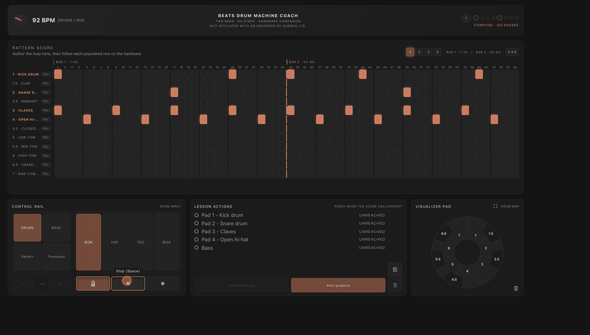

# Beats Drum Machine Coach

A browser-first groove coach for the [Dubreq Stylophone](https://en.wikipedia.org/wiki/Stylophone) — build two-bar, 64-step drum + bass loops, watch them play back on an on-screen visualizer pad, and get guided lessons for reproducing them on real hardware. No installs, no accounts, no backend.



*Not affiliated with or endorsed by Dubreq Ltd.*

## Features

- **64-step pattern grid** — two bars, drums and monophonic bass, four independent sound banks (ROK / HIP / TEC / BOX)
- **Four-slot pattern bank** — author up to four patterns locally, queue a swap that lands cleanly on the next loop boundary
- **Visualizer pad** — a live view of the physical 12-pad Stylophone layout, highlighting whatever's currently sounding
- **Pattern / Transpose / Delete modes** — held-pad transpose and undo-able edit modes for fast iteration
- **Guided lessons** — step-by-step "reach this pad next" coaching once a pattern has content
- **Save / load** — patterns persist locally; export/import as strict-JSON `.beatcoach` files
- **Keyboard play** — top QWERTY row (`Q`–`]`) mirrors the 12 pads for mouse-free jamming

## Getting started

```bash
npm install
npm run dev
```

Open the printed local URL (defaults to `http://localhost:5173`). Requires a desktop-width viewport (≥1280px) — the layout warns below that.

### Build

```bash
npm run build   # type-check + production build
npm run preview # serve the production build locally
```

## Stack

React + TypeScript + Vite, audio via [Tone.js](https://tonejs.github.io/). No backend, no accounts, no analytics.
